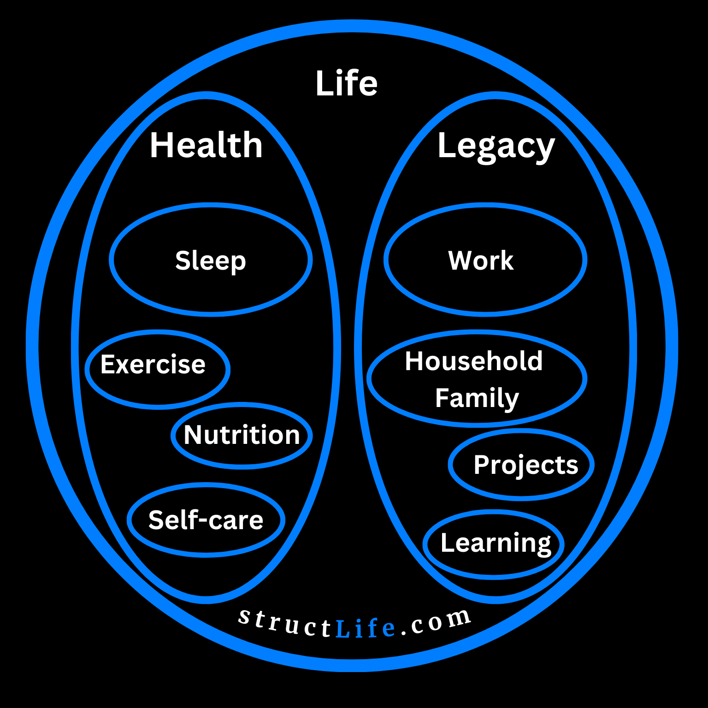

# Health & Legacy: 84 h/w Each

#### Last Updated: November 22, 2023

The core principle of this concept is to equally divide weekly time between Health, which keeps you alive, and your duties that shape your Legacy.

**Life:** Health, Legacy

**Health:** Sleep, Exercise, Nutrition, and Self-Care.

**Legacy:** Work, Projects, Household, and Learning.

The allocation of time to each domain is determined by individual priorities, situations, and life stages. For instance, as a student, you might invest more time in Learning while allocating less to Work, Projects, and Household (including Family).

Once time is allocated to each domain, that structure is further empowered by science and practical considerations, such as deciding the best times for certain activities. Travel time is also considered; it fits into any domain depending on the trip's purpose. For example, if you're learning while on your way to work, then it counts toward your Learning time. 

This framework prioritizes Health by making it a superset. In contrast, the traditional Work-Life balance model gives too much weight to Work, which is a subset of Life/Legacy and not the only way to leave your mark.

##### [Disclaimer](/#/about-disclaimer)  [Privacy](/#/about-privacy-policy)  [Terms&Conditions](/#/about-terms-conditions)

###### © 2023 structLife.com. All rights reserved.