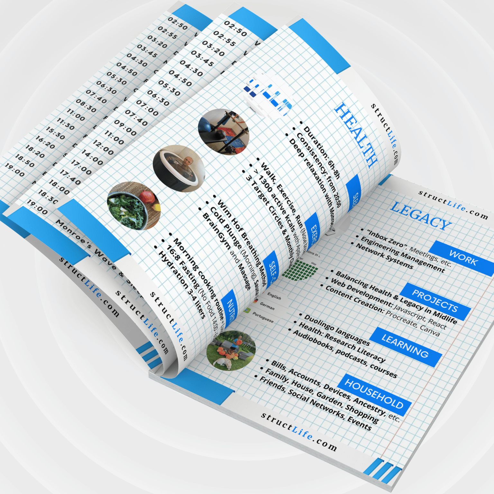

# Welcome

#### Last Updated: November 22, 2023

Hi, I'm Semand. Welcome to my structLife blog where I advocate for a structured lifestyle empowered by science and practical considerations. The main question I delve into is: How can we balance Health and Legacy activities to ensure a healthy life while leaving a meaningful impact?

In other words, I want to help people make informed choices for structuring and controlling their own lifestyles. Because if you don't control your lifestyle (your habits), inevitably, someone else will. Just like a well-planned grocery list can prevent impulsive purchases, effectively structuring our daily activities helps us avoid distractions and stay focused on our health and legacy.

For an intro into my core concept, explore [Health & Legacy: 84h/w Each](/#/about-2023-11-22-health-and-legacy-84-hours-per-week-each)

Here is my backstory...

For almost 30 years, I've been in charge of Mobile Backhaul networks, a role that includes high stress and health challenges, which I was trying to overcome in numerous attempts. Public stereotypes, such as 'if you can't change by 40, you can't at 50 either', made a lifestyle change seem impossible.

However, a shift in the Covid-19 work dynamics, combined with my new Health-Legacy framework, became a game-changer. Through audiobooks, podcasts, and research, I got into the best shape of my life, rediscovering a vitality I hadn't felt since my teens.

In 2-3 years, through simple behaviour changes, I've shed 30kg off an initial weight of 100kg, reduced my body fat from 26% to 14%, brought my BMI down from 32 to 22 and decreased my vascular age by 10-12 years compared to where it was 3 years ago. Along with these and other measurable changes, I have regained the quick recovery ability and the lightness of my teenage years, and I no longer use any medications or supplements. 

But the journey doesn't end there as more new research gives us more to learn as well as new obstacles appear in our way. Improving behavior is a never-ending process. It requires trying, sharing, and learning from each other's experiences. 

That's why I invite you to join me on this journey. Let’s connect and inspire each other towards greater well-being and impactful legacies.

Here's a link to my background: [Finding a Path: My Time Audit](/#/about-2023-11-22-finding-a-path-my-time-audit)

##### [Disclaimer](/#/about-disclaimer)  [Privacy](/#/about-privacy-policy)  [Terms&Conditions](/#/about-terms-conditions)

###### © 2023 structLife.com. All rights reserved.