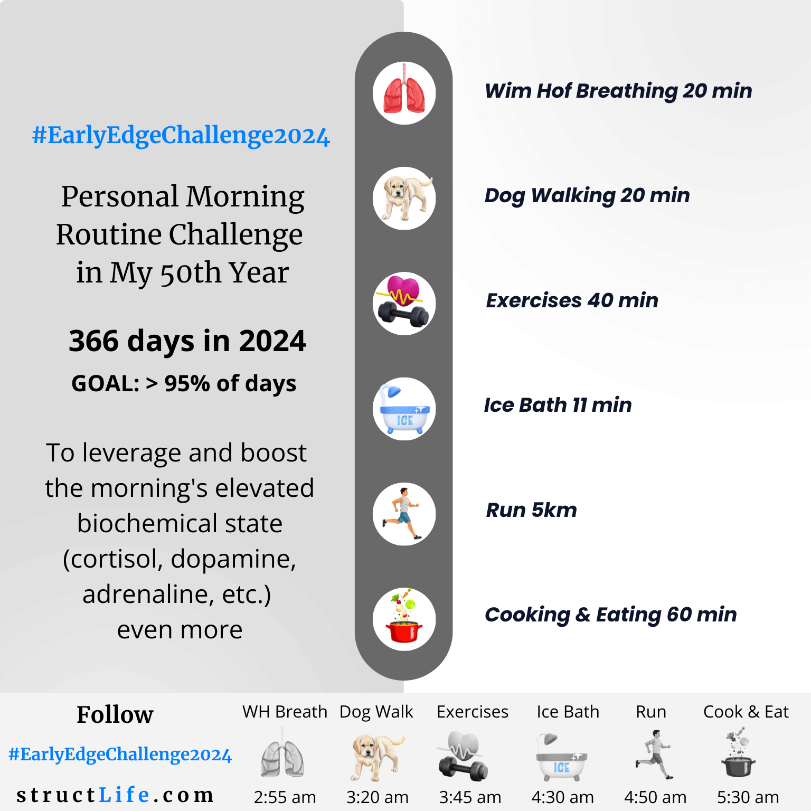

# \#EarlyEdge Challenge2024

#### Last Updated: November 28, 2023

The early morning hours are the most valuable hours due to the body's biochemistry boost, the lowest distraction level, and the control people have over these hours. 

**In my 50th year**, I’m starting my personal morning routine **#EarlyEdgeChallenge2024**, aiming to complete the routine **more than 95% of 366 days**.   

Since I have a job, that means that for most days I will **get up at 3:00 am or earlier**. 

By completing the following 6 activities each morning, I will target leveraging and boosting my biochemical state even more: 

**Wim Hof Breathing 20 min**

**Dog Walking 20 min**

**Exercises 40 min**

**Ice Bath 11 min**

**Run 5km**

**Cooking & Eating 60 min**

I will be updating this post with exact details of each activity over time. 

This routine is my current routine, but achieving >95% is challenging, as many obstacles will stay in my way, such as weather conditions, injuries, family and work commitments.  

##### [Disclaimer](/about-disclaimer)  [Privacy](/about-privacy-policy)  [Terms&Conditions](/about-terms-conditions)

###### © 2023 structLife.com. All rights reserved.