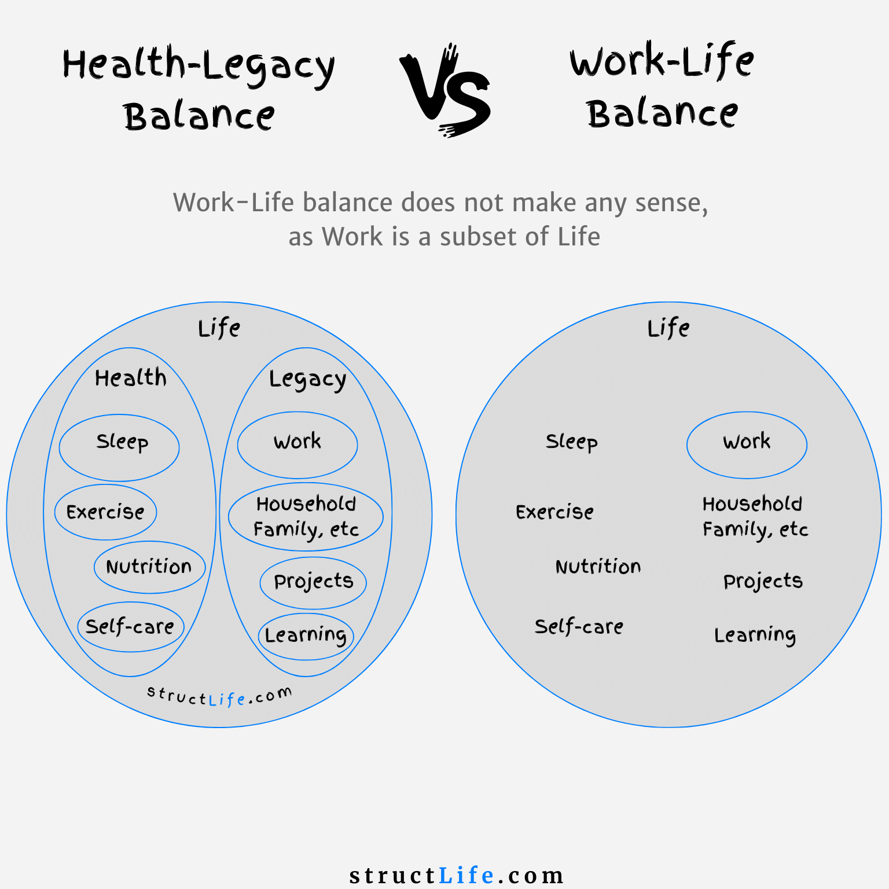

# Health-Legacy vs Work-Life

#### Last Updated: December 15, 2023

The core principle of Health-Legacy balance framework is to equally divide weekly time between Health-related activities, which keep you alive, and your duties that shape your Legacy. This framework prioritizes Health by making it a superset. 

Life: Health, Legacy

Health: Sleep, Exercise, Nutrition, and Self-Care.

Legacy: Work, Projects, Family, Friends, Events, Household, and Learning.

The allocation of time to each domain is determined by individual priorities, situations, and life stages. For instance, as a student, you might invest more time in Learning while allocating less to Work and Projects. 

Once time is allocated to each domain, that structure is further empowered by science and practical considerations, such as deciding the best times for certain activities. For instance, one could schedule action and focus-oriented activities in the morning to take advantage of the body's elevated biochemistry in the first hours after waking.

##### [Disclaimer](/about-disclaimer)  [Privacy](/about-privacy-policy)  [Terms&Conditions](/about-terms-conditions)

###### © 2023 structLife.com. All rights reserved.