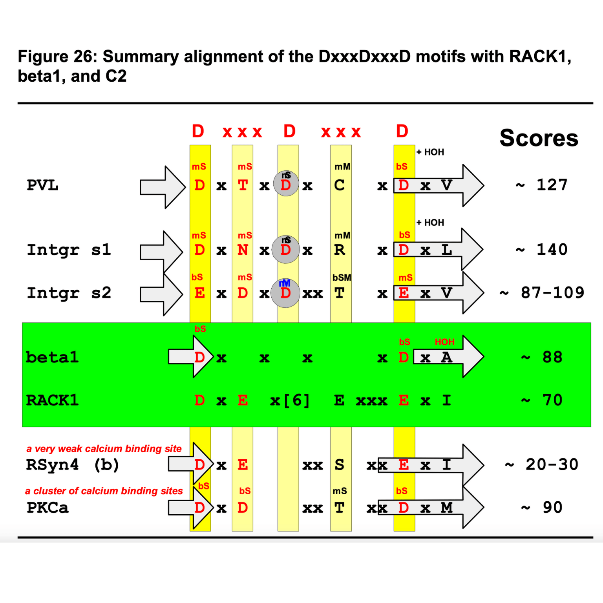

# Predicting Calcium Binding Motifs 2008

#### Last Updated: December 25, 2023

**Abstract**

The C2 domains of protein kinase C (PKC) isozymes mediate Ca2+-dependent membrane docking.  Receptor for activated C-kinase 1 (RACK1) was originally identified as an anchoring protein for PKC, and is now known to interact with many partners in its role as a scaffolding protein.  In 2002 a 3D model for RACK1 was constructed that suggested one component of its WD repeat (propeller) structure could be a β-hairpin with similar Ca2+ binding properties to a C2 domain. In subsequent years, RACK1 has been discovered to be involved in several processes that are sensitive to calcium concentration. This project will survey known Ca2+ binding sites in proteins, particularly those involving β-strands. These template sites will be compared with that predicted for RACK1, and with other proteins in the β-propeller family (e.g. Gβ subunits).

##### [Disclaimer](/about-disclaimer)  [Privacy](/about-privacy-policy)  [Terms&Conditions](/about-terms-conditions)

###### © 2023 structLife.com. All rights reserved.