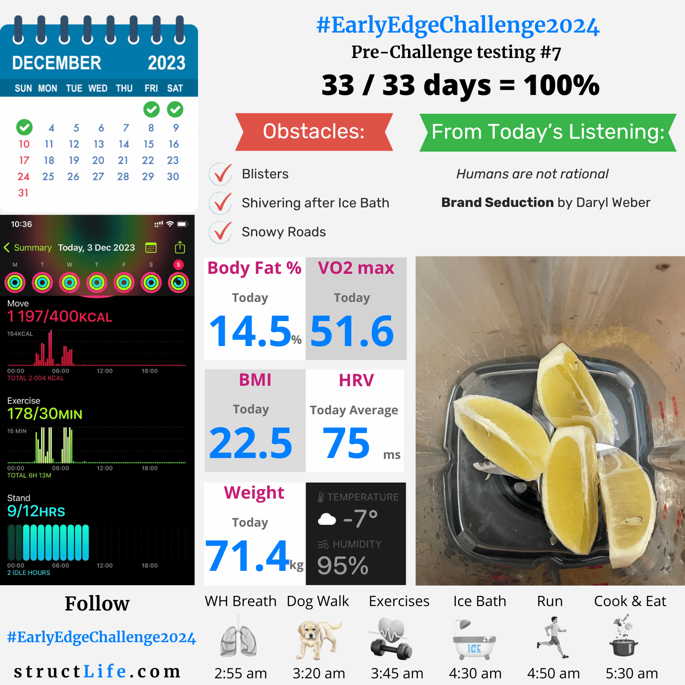

# Pre-challenge Testing #7

#### Last Updated: December 03, 2023

Pre-challenge Testing #7, 

OBSTACLES: Blisters, Shivering after Ice Bath, Snowy Roads. 

FROM TODAY'S LISTENING: "Humans are not rational", Brand Seduction by Daryl Weber. 

Overall it went OK.

##### [Disclaimer](/#/about-disclaimer)  [Privacy](/#/about-privacy-policy)  [Terms&Conditions](/#/about-terms-conditions)

###### © 2023 structLife.com. All rights reserved.