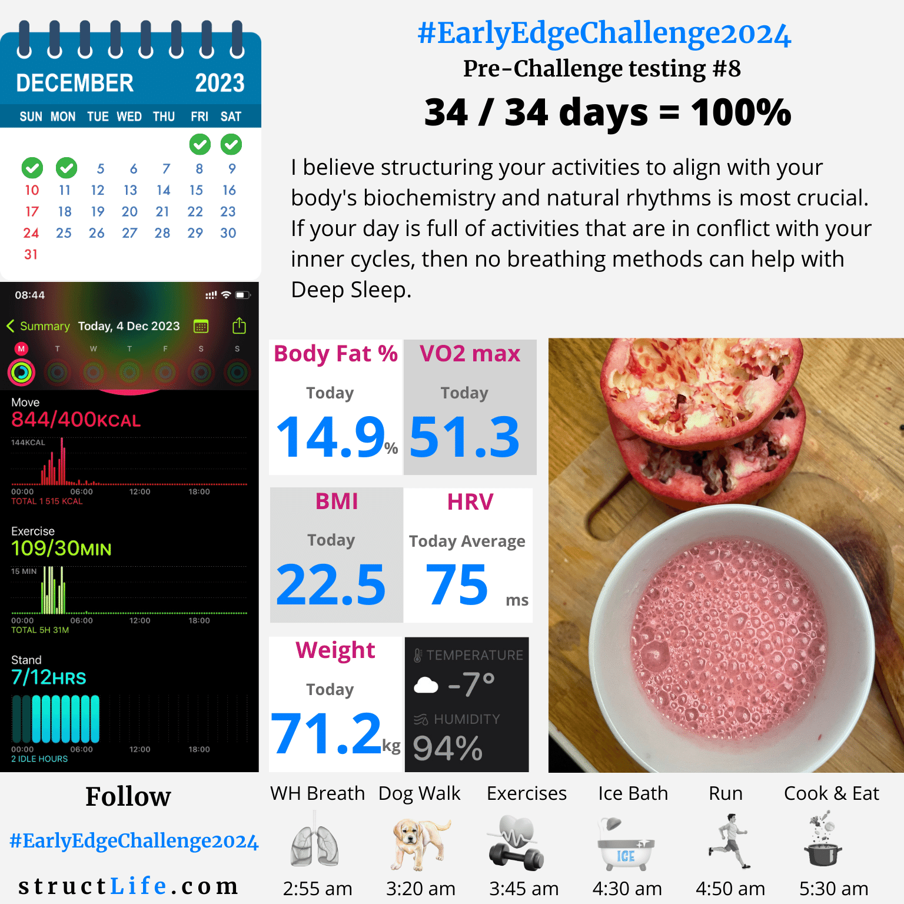

# Pre-challenge Testing #8

#### Last Updated: December 04, 2023

I believe structuring your activities to align with your body's biochemistry and natural rhythms is most crucial. 

If your day is full of activities that are in conflict with your inner cycles, then no breathing methods can help with Deep Sleep. 

##### [Disclaimer](/#/about-disclaimer)  [Privacy](/#/about-privacy-policy)  [Terms&Conditions](/#/about-terms-conditions)

###### © 2023 structLife.com. All rights reserved.