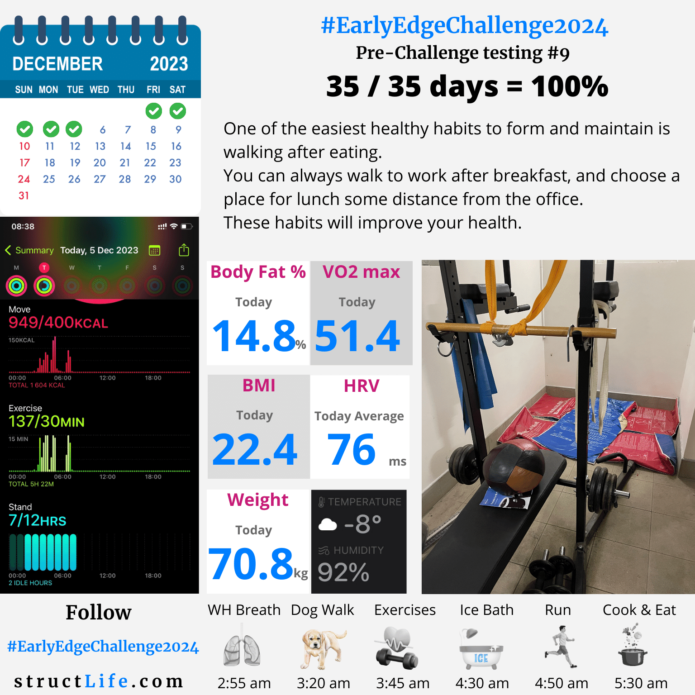

# Pre-challenge Testing #9

#### Last Updated: December 05, 2023

One of the easiest healthy habits to form and maintain is walking after eating. 

You can always walk to work after breakfast, and choose a place for lunch some distance from the office. 

These habits will improve your health. 

##### [Disclaimer](/#/about-disclaimer)  [Privacy](/#/about-privacy-policy)  [Terms&Conditions](/#/about-terms-conditions)

###### © 2023 structLife.com. All rights reserved.