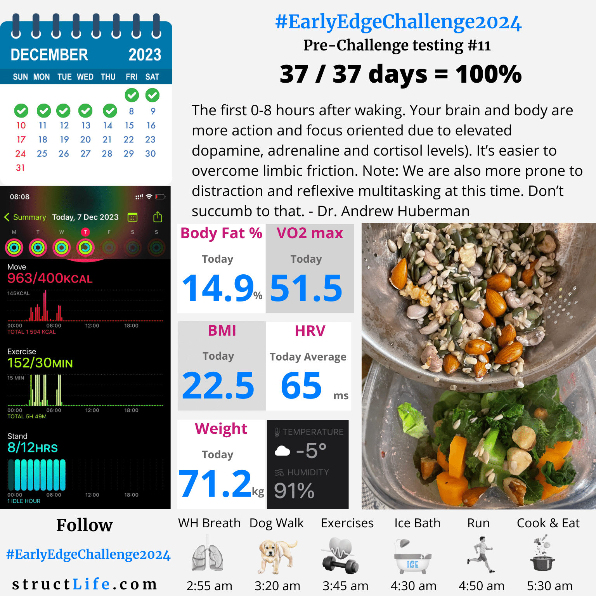

# Pre-challenge Testing #11

#### Last Updated: December 07, 2023

The first 0-8 hours after waking. Your brain and body are more action and focus oriented due to elevated dopamine, adrenaline and cortisol levels. 

It’s easier to overcome limbic friction. Note: We are also more prone to distraction and reflexive multitasking at this time. Don’t succumb to that. - Dr. Andrew Huberman

##### [Disclaimer](/#/about-disclaimer)  [Privacy](/#/about-privacy-policy)  [Terms&Conditions](/#/about-terms-conditions)

###### © 2023 structLife.com. All rights reserved.