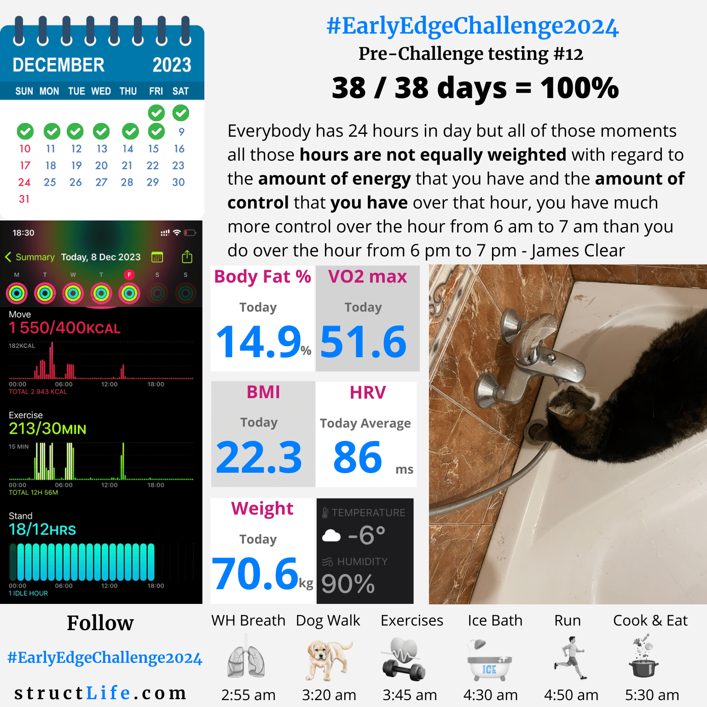

# Pre-challenge Testing #12

#### Last Updated: December 08, 2023

Everybody has 24 hours in day but all of those moments all those hours are not equally weighted with regard to the amount of energy that you have and the amount of control that you have over that hour, you have much more control over the hour from 6 am to 7 am than you do over the hour from 6 pm to 7 pm - James Clear

##### [Disclaimer](/about-disclaimer)  [Privacy](/about-privacy-policy)  [Terms&Conditions](/about-terms-conditions)

###### © 2023 structLife.com. All rights reserved.