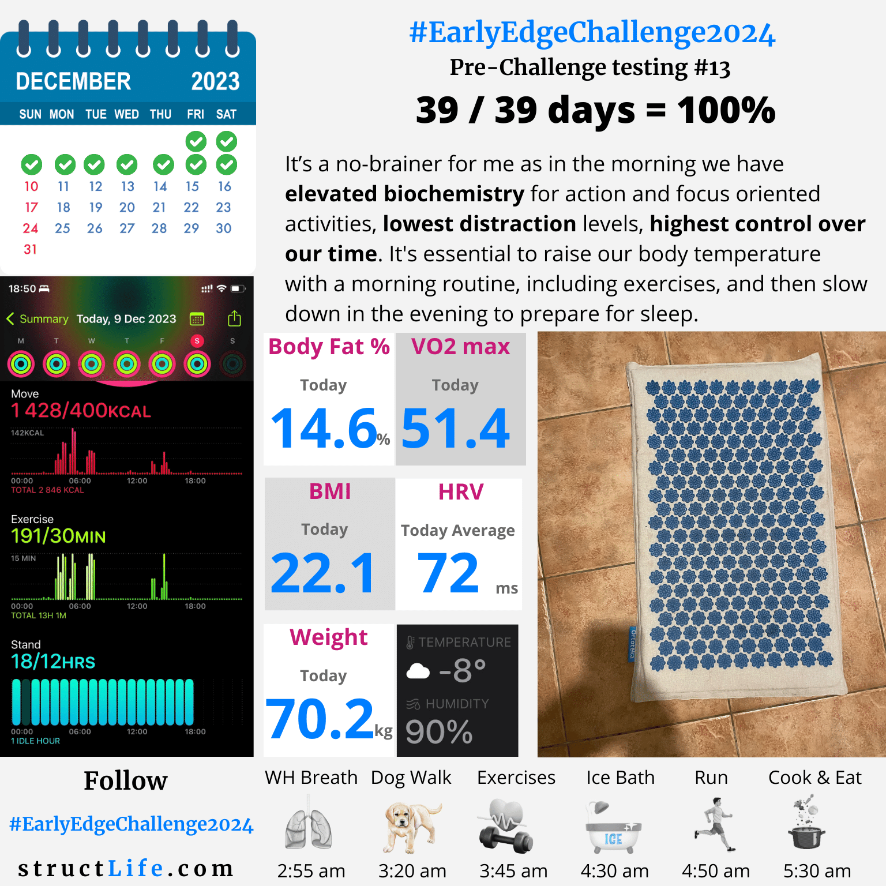

# Pre-challenge Testing #13

#### Last Updated: December 09, 2023

It’s a no-brainer for me as in the morning we have elevated biochemistry for action and focus oriented activities, lowest distraction levels, highest control over our time. It's essential to raise our body temperature with a morning routine, including exercises, and then slow down in the evening to prepare for sleep.

##### [Disclaimer](/about-disclaimer)  [Privacy](/about-privacy-policy)  [Terms&Conditions](/about-terms-conditions)

###### © 2023 structLife.com. All rights reserved.