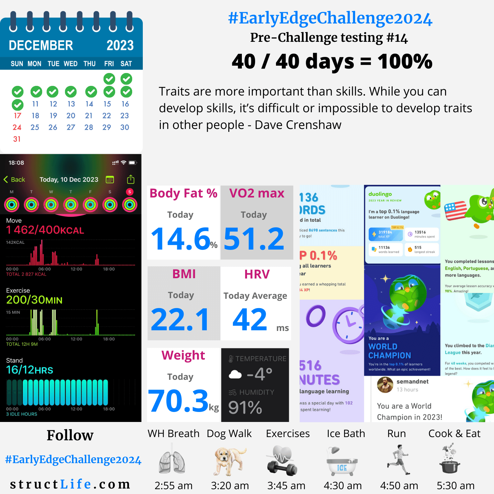

# Pre-challenge Testing #14

#### Last Updated: December 10, 2023

Traits are more important than skills. While you can develop skills, it’s difficult or impossible to develop traits in other people - Dave Crenshaw

##### [Disclaimer](/about-disclaimer)  [Privacy](/about-privacy-policy)  [Terms&Conditions](/about-terms-conditions)

###### © 2023 structLife.com. All rights reserved.