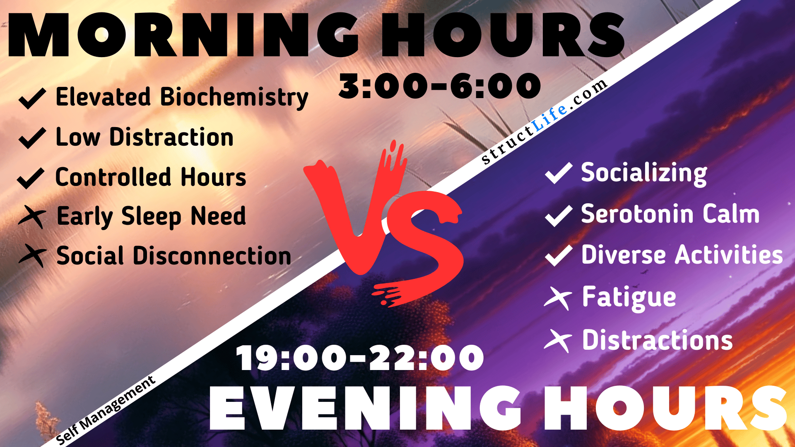

# \#4 Morning vs Evening hours

#### Last Updated: December 16, 2023

We all have the same 24 hours in a day, but not all hours are equal in terms of our biochemical states, levels of distraction, control over our time, and opportunities for socializing and activities.

When it comes to productivity, timing is everything. But what's the best time to get things done? Early birds swear by the morning hours, while night owls thrive in the evening. 

The truth is, there's no one-size-fits-all answer. It ultimately comes down to personal preference and daily responsibilities. 

While early mornings offer a biochemical boost and low distraction levels, social activities tend to take place in the evening. On the other hand, the evening hours provide opportunities for relaxation and stress reduction. 

So, whether you're a "Productivity Rambo" or a night owl, the key is to prioritize sleep and find a routine that works best for you. 

##### [Disclaimer](/about-disclaimer)  [Privacy](/about-privacy-policy)  [Terms&Conditions](/about-terms-conditions)

###### © 2023 structLife.com. All rights reserved.